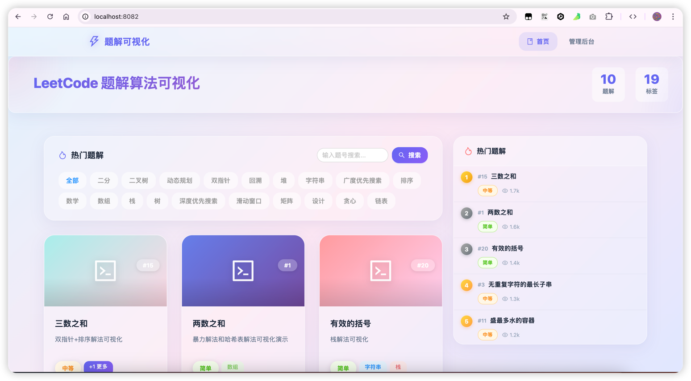
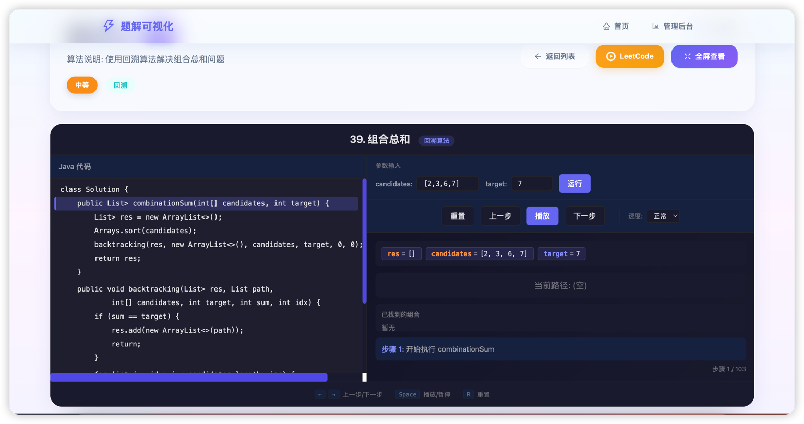
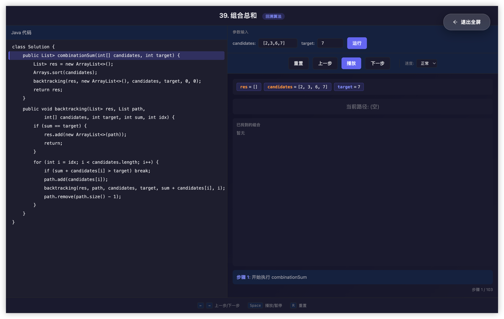
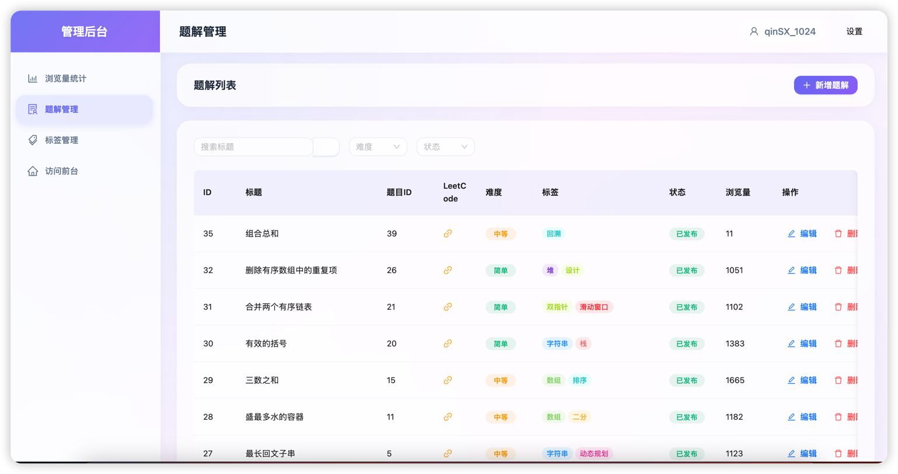

# CLAUDE.md

This file provides guidance to Claude Code (claude.ai/code) when working with code in this repository.

## 项目概述

LeetCode 可视化平台 - 一个用于展示算法题解交互式可视化的全栈项目。

## 技术栈

- **前端**: React 18 + Vite 7 + Ant Design 6 + React Router 7 + Axios
- **后端**: Spring Boot 2.7 + MyBatis-Plus + MySQL + Redis
- **反向代理**: Nginx
- **构建工具**: Maven (后端) / npm (前端)

## 服务端口

| 服务 | 端口 |
|------|----|
| 用户端前端 | 80 |
| 管理后台前端 | 8083 |
| 后端 API | 8080 |

## 常用命令

### 启动项目

```bash
# 一键启动（后端 + 前端构建 + Nginx）
leetcode_visualizer/start.sh

# 停止所有服务
leetcode_visualizer/stop.sh
```

### 后端命令

```bash
cd leetcode_visualizer

# 开发模式启动
mvn spring-boot:run

# 打包
mvn clean package -DskipTests

# 运行 JAR
java -jar target/visualizer-1.0.0.jar
```

### 前端命令

```bash
# 用户端
cd leetcode_visualizer/frontend
npm run dev      # 开发模式
npm run build    # 生产构建

# 管理后台
cd leetcode_visualizer/frontend/admin
npm run dev      # 开发模式
npm run build    # 生产构建
```

### Nginx 命令

```bash
# 启动
nginx -c leetcode_visualizer/nginx/nginx.conf

# 重载配置
nginx -s reload -c leetcode_visualizer/nginx/nginx.conf

# 停止
nginx -s stop -c leetcode_visualizer/nginx/nginx.conf

# 测试配置
nginx -t -c leetcode_visualizer/nginx/nginx.conf
```

## 项目结构

```
leetcode_visualizer/
├── src/                    # Spring Boot 后端源码
│   └── main/java/com/leetcode/visualizer/
│       ├── controller/      # API 控制器
│       ├── service/        # 业务逻辑
│       ├── mapper/        # MyBatis 数据访问
│       ├── entity/        # 实体类
│       ├── vo/            # 视图对象
│       ├── config/        # 配置类
│       └── security/      # 安全相关 (JWT)
├── frontend/              # 用户端前端
│   ├── src/
│   │   ├── pages/        # 页面组件 (Home.jsx)
│   │   ├── components/   # 公共组件 (HotSolutions.jsx, TodayNewSolutions.jsx)
│   │   ├── api/          # API 请求封装
│   │   ├── router/       # 路由配置
│   │   └── styles/      # 样式文件
│   └── dist/             # 构建产物
├── frontend/admin/        # 管理后台前端
│   ├── src/
│   │   ├── pages/       # 页面组件 (ViewStats.jsx, SolutionManage.jsx, TagManage.jsx)
│   │   ├── api/         # API 请求封装
│   │   ├── router/      # 路由配置
│   │   └── styles/      # 样式文件
├── nginx/                # Nginx 配置
├── sql/                  # 数据库脚本
├── doc/                  # 需求文档
└── start.sh             # 启动脚本
```

## 前端架构

- **用户端** (`/frontend`): 端口 8082，通过 Nginx 访问
  - 首页: 题解卡片列表展示、搜索、热门题解、最近新增侧边栏
  - 详情页: 题解可视化内容 (iframe 加载 HTML)
  - 路由: `/`, `/solution/:id`, `/login`, `/admin/*`

- **管理后台** (`/frontend/admin`): 端口 8083
  - 浏览量统计: ViewStats.jsx - 概览卡片、趋势图表、热门排行
  - 题解管理: SolutionManage.jsx - 列表、新增、编辑、删除
  - 标签管理: TagManage.jsx
  - 路由: `/admin/view-stats`, `/admin/solutions`, `/admin/tags`

## API 端点

后端 API 基础路径: `http://localhost:8080/api`

### 用户端
- `GET /solutions` - 获取题解列表（支持 tagId、questionId 筛选）
- `GET /solutions/hot` - 获取热门题解
- `GET /solutions/today` - 获取今日新增题解
- `GET /solutions/:id` - 获取题解详情（自动增加浏览量）

### 标签
- `GET /tags` - 获取标签列表

### 管理后台（需认证）
- `GET /admin/solutions` - 管理后台题解列表
- `POST /admin/solutions` - 创建题解
- `PUT /admin/solutions/:id` - 更新题解
- `DELETE /admin/solutions/:id` - 删除题解
- `GET /admin/tags` - 管理后台标签列表
- `POST /admin/tags` - 创建标签
- `DELETE /admin/tags/:id` - 删除标签
- `POST /admin/upload/html` - 上传 HTML 可视化文件
- `POST /admin/upload/cover` - 上传封面图片

### 浏览量统计（需认证）
- `GET /admin/view-stats/overview` - 统计概览
- `GET /admin/view-stats` - 维度统计（day/week/month/year）
- `GET /admin/view-stats/top` - 热门题解排行

## 访问地址

- 用户端: http://localhost:8082
- 管理后台: http://localhost:8083/admin
- 登录页: http://localhost:8083

## 注意事项

1. 前端修改后需要重新 `npm run build` 并重启 Nginx 才能生效
2. API 请求通过 Nginx 代理到后端 8080 端口
3. 题解可视化 HTML 文件存储在 `/leetcode_visualizer/nginx/html/solutions/`
4. 封面图片存储在 `/leetcode_visualizer/nginx/html/covers/`
5. 管理后台需要登录 JWT Token，存储在 localStorage (`adminToken`)
6. 前端 API 认证：需要登录后在请求头添加 `Authorization: Bearer {token}`
7. 文件上传目录需要后端有写入权限

## 运行界面
### 首页

### 算法可视化详情页

### 执行流程页面


## 后端管理

### 题解和标签管理（可新增编辑等）（包含浏览量统计）
